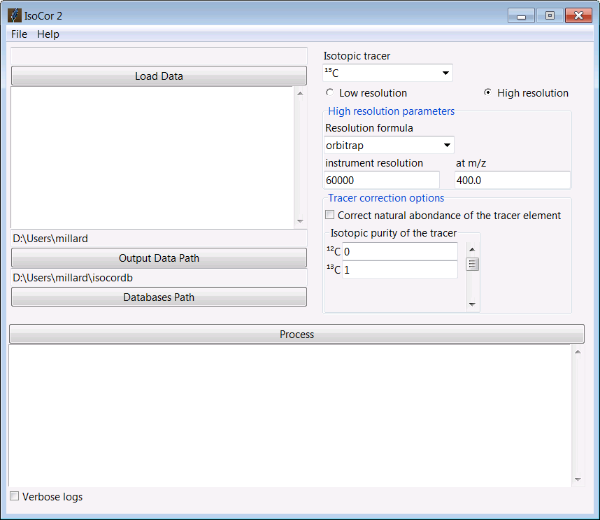
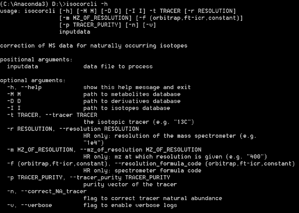

# IsoCor

**Iso**tope **Cor**rection of mass spectrometry data in isotope labeling experiments.

IsoCor corrects raw MS data (mass fractions) for
naturally-occurring isotopes of all elements and purity of the
isotopic tracer.
The output of IsoCor is the isotopologue distribution of the molecule
(i.e. the relative fractions of molecular entities differing only in the number
of isotopic substitutions of the tracer). IsoCor also calculates
the mean enrichment (i.e. the mean isotopic content in the molecule) in metabolites.

It is one of the routine tools that we use at the [MetaSys team](http://www.lisbp.fr/en/research/integrated-metabolism-and-dynamics-of-metabolic-systems.html) and [MetaToul platform](https://www6.toulouse.inra.fr/metatoul_eng/) in isotopic studies of metabolic systems.

The code is open-source, and available under a GPLv3 license.

Detailed documentation can be found [online](https://isocor.readthedocs.io/en/latest/) or in 'isocor.pdf'.

## Key features
* **correction of naturally occuring isotopes**, both for non-tracer and tracer elements,
* **correction of tracer purity**,
* shipped as a library with both a **graphical and command line interface**,
* mass-spectrometer and resolution agnostic,
* can be used with any tracer element (having two or more isotopes)
* account for the contribution of derivatization steps (if any),
* open-source, free and easy to install everywhere where Python 3 and pip run,
* biologist-friendly.

We strongly encourage you to read the Tutorials before using IsoCor.

## Installation
IsoCor was tested on Windows, Unix and MacOS platforms.

IsoCor requires Python 3.5 or higher. If you do not have a Python environment
configured on your computer, we recommend that you follow the instructions
from [Anaconda](https://www.anaconda.com/download/).

Then, just type in a terminal:

```bash
pip install isocor
```
You are now ready to start IsoCor.

## Usage
Extensive details on IsoCor usage are provided in the [documentation](https://isocor.readthedocs.io/en/latest/).

### Graphical User Interface

To start the Graphical User Interface, type in a terminal:

```bash
isocor
```

The IsoCor window will open.



Select the measurements file, modify the correction parameters (isotopic tracer, resolution, etc) according to your experiment,
and click on 'Process'. IsoCor proceeds automatically to the corrections and display its progress
and important messages.

The output of the calculations (i.e. isotopologue distributions) will be written in a text file
along a log file.

Warning: The correction options must be carefully selected to ensure reliable interpretations of labeling data, as detailed in the [documentation](https://isocor.readthedocs.io/en/latest/).

Note: IsoCor silently overwrite (results and log) files if they already exist. So take care to copy your results elsewhere if you want to protect them from overwriting.


### Command Line Interface

A command line interface is also available to use IsoCor, with the command:

```bash
isocorcli
```

`isocorcli` takes the following arguments:




Details on arguments and usage are provided in the [documentation](https://isocor.readthedocs.io/en/latest//).


## Developer guide
Contributions are welcome.

Please work on your own branch/fork,
follow [PEP8](https://www.python.org/dev/peps/pep-0008/) style guide,
and make sure you pass all the tests before a `merge`.

### Local install with pip
In development mode, do a `pip install -e /path/to/HRcor` to install
locally the development version.

### Unit tests
Isotope correction is a complex task and we use unit tests to make sure
that critical features are not compromised during development.

You can **run all tests** by calling
`pytest` in the shell
at project's root directory. `pytest` must be installed beforehand.

### Build documentation

Dependencies:
* Sphinx
* sphinx-rtd-theme
* napoleon
* nbsphinx
* argparse

Build the HTML documentation with:

```bash
cd doc
make html
```

The documentation can be found in `/doc/_build/html/index.html`.


Build the PDF documentation with (you will need `latexmk` and associated packages):

```bash
cd doc
make latexpdf
```

## References
1. Millard, P., et al. IsoCor: correcting MS data in isotope labeling experiments. Bioinformatics 2012;28:1294-1296
2. Su, X., et al. Metabolite spectral accuracy on orbitraps. Analytical chemistry 2017;89:5940-5948
3. Millard, P., Delepine, B. Guionnet, M., Heuillet, M., Bellvert, F. and Letisse, F. IsoCor: isotope correction for high-resolution MS labeling experiments. Submitted

## Contact
Pierre Millard

millard@insa-toulouse.fr
