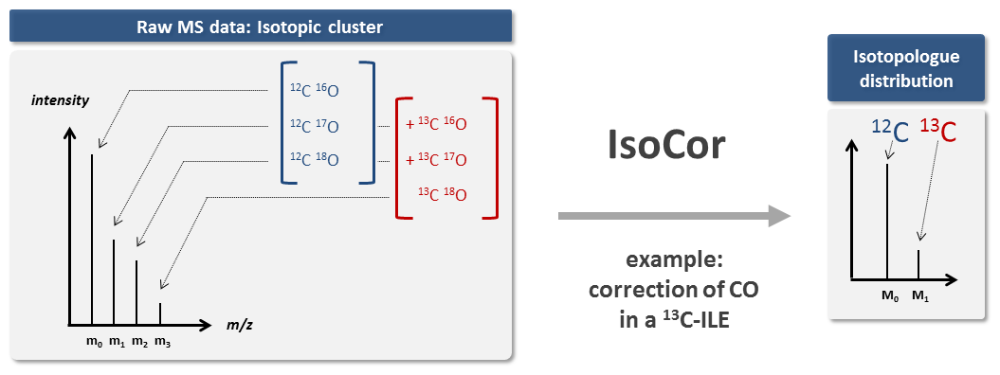

IsoCor: Isotope Correction for mass spectrometry labeling experiments
********************************************************************************

Welcome to IsoCor documentation!
----------------------------------------

**IsoCor is a scientific software dedicated to the correction of mass spectrometry (MS) data for naturally
occuring isotopes**.
IsoCor corrects raw MS data (:ref:`mass fractions <mass fractions>`) for
naturally-occurring isotopes of all elements and purity of the
:ref:`isotopic tracer <Tracer isotopologues>`.
The output of IsoCor is the :ref:`isotopologue distribution <isotopologue distribution>`
(i.e. the relative fractions of molecular entities differing only in the number
of isotopic substitutions of the tracer) of the molecule. IsoCor also calculates
the mean enrichment (i.e. the mean isotopic content in the molecule) in metabolites.

It is one of the routine tools that we use at the `MetaSys team <http://www.toulouse-biotechnology-institute.fr/en/research/molecular-physiology-and-metabolism/metasys.html>`_ and `MetaToul platform <http://www.metatoul.fr>`_ in isotopic studies of metabolic systems.

The code is open-source, and available on `GitHub <https://github.com/MetaSys-LISBP/IsoCor/>`_ under a :ref:`GPLv3 license <license>`.

This documentation is available on Read the Docs (`https://isocor.readthedocs.io <https://isocor.readthedocs.io/>`_)
and can be downloaded as a `PDF file <https://readthedocs.org/projects/isocor/downloads/pdf/latest/>`_.

.. rubric:: Key features

* **correction of naturally occuring isotopes**, both for non-tracer and tracer elements,
* **correction of tracer purity**,
* shipped as a library with both a **graphical and command line interface**,
* mass-spectrometer and :ref:`resolution <resolution>` agnostic,
* can be applied to singly- and multiply-charged ions
* can be used with any tracer element (having two or more isotopes)
* account for the contribution of derivatization steps (if any),
* generate InChIs of isotopically-resolved (tracer) isotopologues,
* open-source, free and easy to install everywhere where Python 3 and pip run,
* biologist-friendly.

.. seealso:: We strongly encourage you to read the :ref:`Tutorials` before using IsoCor.

.. toctree::
   :maxdepth: 2
   :caption: Usage

   quickstart.rst
   tutorials.rst
   cite.rst

.. toctree::
   :maxdepth: 1
   :caption: Miscellaneous

   faq.rst
   definitions.rst
   library_doc.rst
   license.rst

.. todolist::
