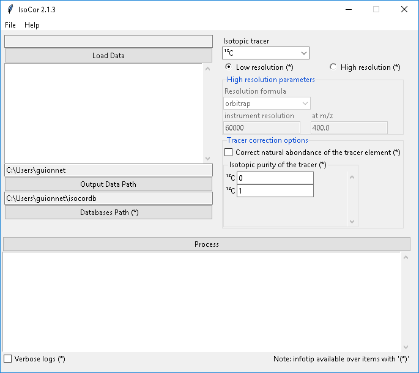

..  _Quick start:

Quick start
********************************************************************************

Installation
------------------------------------------------

IsoCor requires Python 3.5 or higher. If you do not have a Python environment
configured on your computer, we recommend that you follow the instructions
from `Anaconda <https://www.anaconda.com/download/>`_.

Then, open a terminal (e.g. run *Anaconda Prompt* if you have installed Anaconda) and type:

.. code-block:: bash

  pip install isocor

You are now ready to start IsoCor.

If this method does not work, you should ask your local system administrator or
the IT department "how to install a Python 3 package from PyPi" on your computer.

Alternatives & update
^^^^^^^^^^^^^^^^^^^^^^^^^^^^^^^^^^^^^^^^

If you know that you do not have permission to install software systemwide,
you can install IsoCor into your user directory using the :samp:`--user` flag:

.. code-block:: bash

  pip install --user isocor

If you already have a previous version of IsoCor installed, you can upgrade it to the latest version with:

.. code-block:: bash

  pip install --upgrade isocor

Alternatively, you can also download all sources in a tarball from `GitHub <https://github.com/MetaSys-LISBP/IsoCor>`_,
but it will be more difficult to update IsoCor later on.

Usage
------------------------------------------------

Graphical User Interface
^^^^^^^^^^^^^^^^^^^^^^^^^^^^^^^^^^^^^^^^

To start the Graphical User Interface, type in a terminal (Windows: *Anaconda Prompt*):

.. code-block:: bash

  isocor

The IsoCor window will open. If the window fails to open, have a look at our
:ref:`dedicated troubleshooting procedure <failed_gui>` to solve the problem.

Select the measurements file, modify the correction parameters (isotopic tracer, resolution, etc) according to your experiment,
and click on :samp:`Process`. IsoCor proceeds automatically to the corrections and display its progress
and important messages.

.. warning:: The correction options must be carefully selected to ensure reliable interpretations of labeling data, as detailed in the :ref:`Tutorials`.

The output of the calculations (i.e. isotopologue distributions) will be written in a text file
along a log file.

.. note:: IsoCor silently overwrites (results and log) files if they already exist. So take care to copy your results elsewhere if you want to protect them from overwriting.

.. seealso:: Tutorial :ref:`First time using IsoCor` has example data
            that you can use to test your installation.

Command Line Interface
^^^^^^^^^^^^^^^^^^^^^^^^^^^^^^^^^^^^^^^^

To process your data, type in a terminal:

.. code-block:: bash

  isocorcli [command line options]

Here after the available options with their full names are enumerated and detailed.

.. argparse::
   :module: isocor.ui.isocorcli
   :func: parseArgs
   :prog: isocorcli
   :nodescription:

IsoCor proceeds automatically to the corrections and display its progress
and important messages.

.. warning:: The correction options must be carefully selected to ensure reliable interpretations of labeling data, as detailed in the :ref:`Tutorials`.

.. seealso:: Tutorial :ref:`First time using IsoCor` has example data
            that you can use to test your installation.

Library
^^^^^^^^^^^^^^^^^^^^^^^^^^^^^^^^^^^^^^^^

IsoCor is also available as a library (a Python module) that you can import directly in your Python
scripts:

.. code-block:: python

  import isocor

.. seealso::  Have a look at our :ref:`library showcase <Library documentation>` if you are interested into this experimental feature.
